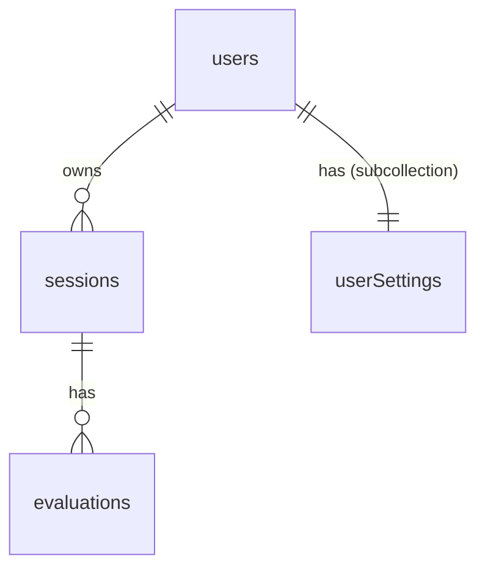

# InterviewSense – Firestore NoSQL Database Schema

## Overview

Firestore is a document-based NoSQL database. Data is organized into **collections** of **documents**. Each document is a JSON-like map of fields. Sub-collections can be nested under documents for related data.



---

## Collections

### 1. `users`

> Stores user profiles. Created on first sign-up. Doc ID = Firebase Auth `uid`.

| Field           | Type       | Description                                    |
|-----------------|------------|------------------------------------------------|
| `uid`           | `string`   | Firebase Auth UID (same as document ID)        |
| `email`         | `string`   | User's email address                           |
| `displayName`   | `string`   | User's display name                            |
| `photoURL`      | `string?`  | Profile picture URL (nullable)                 |
| `createdAt`     | `string`   | ISO 8601 timestamp of account creation         |
| `updatedAt`     | `string`   | ISO 8601 timestamp of last profile update      |

**Path:** `/users/{uid}`

#### Sub-collection: `users/{uid}/settings`

> Stores per-user preferences. Single document with ID `preferences`.

| Field            | Type       | Description                                  |
|------------------|------------|----------------------------------------------|
| `notifications`  | `boolean`  | Enable interview reminders                   |
| `emailAlerts`    | `boolean`  | Receive email performance updates            |
| `difficulty`     | `string`   | Default difficulty: `beginner` / `intermediate` / `advanced` |
| `theme`          | `string`   | UI theme: `light` / `dark` / `auto`          |

**Path:** `/users/{uid}/settings/preferences`

---

### 2. `sessions`

> Each document represents one interview session.

| Field              | Type                                    | Description                                         |
|--------------------|-----------------------------------------|-----------------------------------------------------|
| `userId`           | `string`                                | UID of the user who owns this session               |
| `type`             | `string`                                | Interview type (e.g., `Technical`, `Behavioral`)    |
| `company`          | `string?`                               | Target company (optional)                           |
| `role`             | `string?`                               | Target role (optional)                              |
| `difficulty`       | `string`                                | `beginner` / `intermediate` / `advanced`            |
| `score`            | `number?`                               | Final score out of 10 (null while in-progress)      |
| `durationSeconds`  | `number?`                               | Total duration of the session in seconds            |
| `questions`        | `string[]`                              | List of questions asked during the session          |
| `transcript`       | `Array<{ role: 'ai'\|'user', text: string }>` | Full conversation transcript                   |
| `status`           | `string`                                | `in-progress` / `completed`                         |
| `createdAt`        | `string`                                | ISO 8601 timestamp                                  |
| `completedAt`      | `string?`                               | ISO 8601 timestamp when session ended               |

**Path:** `/sessions/{sessionId}`

**Indexes needed:**
- `userId` + `createdAt` (descending) — for fetching a user's sessions

---

### 3. `evaluations`

> Per-session evaluation events generated by the AI after a session.

| Field        | Type       | Description                                 |
|--------------|------------|---------------------------------------------|
| `sessionId`  | `string`   | Reference to parent session document ID     |
| `userId`     | `string`   | UID of the user (denormalized for queries)  |
| `category`   | `string`   | Evaluation category (e.g., `Communication`) |
| `score`      | `number`   | Score for this category                     |
| `notes`      | `string`   | AI-generated feedback text                  |
| `event`      | `object?`  | Raw evaluation event payload                |
| `createdAt`  | `string`   | ISO 8601 timestamp                          |

**Path:** `/evaluations/{evaluationId}`

**Indexes needed:**
- `sessionId` + `createdAt` (ascending) — for fetching evaluations per session
- `userId` + `createdAt` (descending) — for aggregate user reports

---

## Firestore Security Rules (Recommended)

```javascript
rules_version = '2';
service cloud.firestore {
  match /databases/{database}/documents {

    // Users can read/write their own profile
    match /users/{uid} {
      allow read, write: if request.auth != null && request.auth.uid == uid;

      match /settings/{doc} {
        allow read, write: if request.auth != null && request.auth.uid == uid;
      }
    }

    // Users can only access their own sessions
    match /sessions/{sessionId} {
      allow read, update, delete: if request.auth != null
        && resource.data.userId == request.auth.uid;
      allow create: if request.auth != null
        && request.resource.data.userId == request.auth.uid;
    }

    // Users can only access evaluations for their own sessions
    match /evaluations/{evalId} {
      allow read: if request.auth != null
        && resource.data.userId == request.auth.uid;
      allow create: if request.auth != null
        && request.resource.data.userId == request.auth.uid;
    }
  }
}
```

---

## Data Flow Summary

1. **Sign Up** → Create Firebase Auth user → Create `/users/{uid}` document with profile data.
2. **Start Interview** → Create `/sessions/{sessionId}` with `status: "in-progress"` and `userId`.
3. **During Interview** → Transcript is updated in real-time on the session document.
4. **End Interview** → Update session with `status: "completed"`, `score`, `completedAt`, `durationSeconds`.
5. **AI Evaluation** → Create `/evaluations/{evalId}` documents linked to the session.
6. **Dashboard** → Query sessions where `userId == currentUser.uid`, compute stats client-side.
